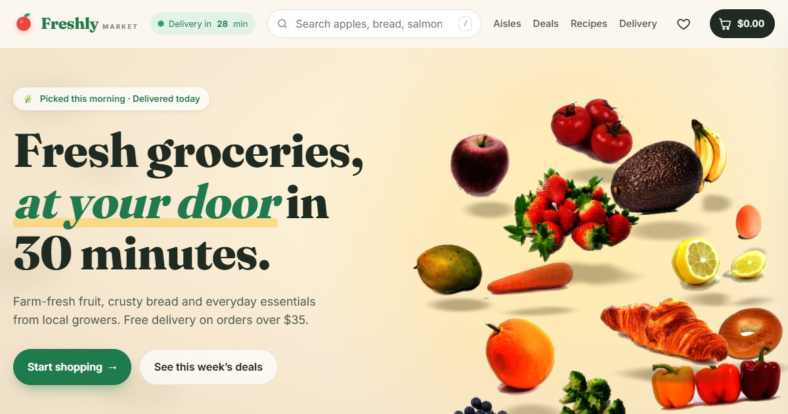

# Fresh Grocery Website: Freshly Market

**Live site:** https://dhanoliya-ji.github.io/Fresh-Grocery-Website/

A 3D, interactive storefront for **Freshly**, a fictional neighbourhood grocery store. It's a static site built with Vite, Three.js and GSAP. There's no backend: the cart and wishlist live in the browser, and checkout is a demo that takes no payment.



## What's inside

### 3D and animation

- **3D hero**: real produce photos cut out and rendered in WebGL with fake volume lighting, glinting water droplets and soft contact shadows. The fruit drops in and bounces after the loader. Click one to squeeze it into a juice splash and jump to its aisle. The light moves from a low morning sun to noon as you scroll.
- **3D store walk**: a pinned section where scrolling walks you down a real 3D aisle, with shelves stocked with every product, hanging aisle signs and price tags. Move the mouse to look around, and click a product to open it.
- **3D store map**: an isometric floor plan built from CSS 3D boxes. It tilts toward the mouse, a little shopper wanders the aisles, and clicking an aisle shops it.
- **Walk the aisles**: 8 category shelves with 3D tilt and glare.
- **Fresh deals**: a 3D ring carousel with a flip-clock countdown, plus bundle boxes.
- Headings rise word by word, the recipe ingredients fly onto the plate as you scroll, and the delivery van drives to a house, drops a parcel and drives off.
- Custom cursor, magnetic buttons, rolling odometer prices and an apple-into-basket page loader.

### Shopping

- **Shop**: 52 products with filters, sorting, live search (press `/`) and **voice search** ("add two bananas", "show bakery").
- **Freshness meter** on fresh products ("Picked 6h ago").
- **Compare** up to three products side by side, with the best value highlighted.
- **Buy again / recently viewed** row, plus one-click reorder of the last basket.
- **Basket drawer**: items fall into the basket with real physics. Promo codes `FRESH10`, `FREESHIP` and `HELLO5` work, and there's a free-delivery progress bar.
- **Demo checkout**: address → delivery window → card preview, with a **scratch card** that reveals a surprise discount.
- **Live order tracking**: an animated map with the van driving your route, an ETA and status steps. It runs about 12× faster for the demo.

### Extras

- **Daily prize wheel**: a tilted 3D wheel, one spin a day, and the prize goes straight into the basket.
- **Smoothie builder**: drag fruit into a glass blender, blend it, and the drink takes the mixed colour of the fruit. Then add the ingredients.
- **Meal planner**: drag dinners onto the week and it writes a combined shopping list.
- **Seasonal mode**: picks the season from the date, with falling leaves, snow, blossom or summer sparkles, and seasonal picks. You can preview any season.
- **Evening market theme**: a warm, lamp-lit dark theme. The 3D scenes relight too.
- **Farmer profiles**: eight growers with their stories, practices and products.
- Live activity popups on desktop, clearly labelled as demo data.

### Shopping helpers

- **What can I cook?**: tick what's in your fridge, and recipes re-rank live by how much you already have. One click adds only the missing items.
- **Nutrition goals**: calorie and protein rings in the basket fill toward your daily target for the people and days you're shopping for.
- **Budget mode**: set a budget and a bar warns you as you near it, with one-tap cheaper swaps (steak → chicken, coffee → tea).
- **Weekly box subscription**: pick a box, size, day and frequency, watch the 3D crate fill with this week's produce, and skip any week.
- **Allergy filter**: hide anything with nuts, dairy, gluten, eggs, fish or shellfish across the shop and search, with warnings everywhere else.
- **Shopping list that ticks itself off**: type or say "milk, 2 bananas, bread", and each line is matched to a product and crossed off when it lands in the basket.
- **Price history**: an 8-week animated chart in each product view, plus a sparkline and "Lowest in 8 weeks" label on deals.

### Across the site

- **Three languages**: English, हिन्दी and Español. That covers the interface, product names, recipes and voice input. Product descriptions, farm stories and reviews stay in English.
- **Works offline and installable**: a service worker caches the whole store, so it browses with no connection, and it can be installed as an app from the browser (or "Add to Home Screen" on iPhone).
- **Accessibility panel**: bigger text, high contrast, an easy-read font, reduce motion (turns off the 3D movement) and the evening theme.
- Also respects the system `prefers-reduced-motion` setting and works on phones. Everything is saved in the browser (localStorage), so nothing needs a server.

Translations live in [src/i18n-dict.js](src/i18n-dict.js). The English text is the key, so adding a language means adding one more block.

## Run locally

```bash
npm install
npm run dev       # http://localhost:5173
npm run build     # production build in dist/
npm run preview   # serve the build
```

## Editing the store

Everything the shop sells is in [src/data.js](src/data.js):

- `STORE`: name, free-delivery threshold, fees
- `CATEGORIES`: aisles (name, blurb, colour, hero image)
- `PRODUCTS`: `P(id, name, category, price, unit, image, { old, badges, rating, origin, desc, kcal, … })`
- `DEALS`, `BUNDLES`, `RECIPE`, `REVIEWS`
- `FARMS` (grower profiles), `MEALS` (meal planner), `BLEND` (smoothie colours), `SEASONS`, `PRIZES` (daily wheel)

Images live in `public/img/`:

- `p/` holds product photos.
- `c/` holds transparent cut-outs, used when a product has `cut: true`.
- `s/` holds scene photos.

## Deploy to GitHub Pages

The repo includes a workflow ([.github/workflows/deploy.yml](.github/workflows/deploy.yml)) that builds and publishes the site on every push to `main`.

1. Create a new repository on GitHub, for example `Fresh-Grocery-Website`.
2. Push this folder to it:
   ```bash
   git init
   git add .
   git commit -m "Freshly Market"
   git branch -M main
   git remote add origin https://github.com/<your-username>/Fresh-Grocery-Website.git
   git push -u origin main
   ```
3. On GitHub, open **Settings → Pages** and set **Source** to **GitHub Actions**.
4. Wait for the "Deploy to GitHub Pages" run under the **Actions** tab to finish (about a minute). The site is then live at
   `https://<your-username>.github.io/Fresh-Grocery-Website/`

Every later `git push` redeploys automatically. Asset paths are relative (`base: './'` in [vite.config.js](vite.config.js)), so the repo can have any name.

## Credits

Photos are CC0 / public domain or Creative Commons licensed, from rawpixel, Wikimedia Commons, Flickr and Openverse. The full per-image list is in [public/img/credits.json](public/img/credits.json) and in the site footer under **Photo credits**.

Freshly is a fictional store made for demonstration. Nothing is for sale.
